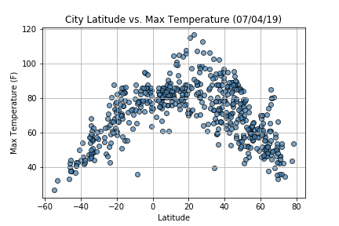
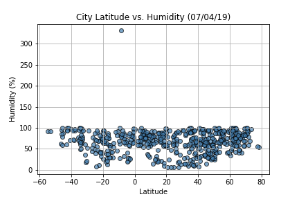
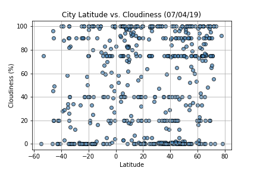
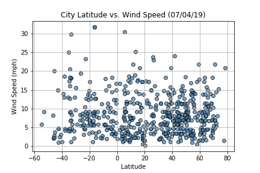
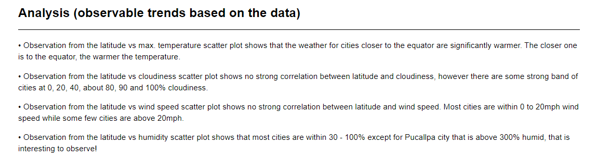

# What's the Weather Like?

## Background

Whether financial, political, or social -- data's true power lies in its ability to answer questions definitively. In this work, the objective is to use Python requests, APIs, and JSON traversals to answer a fundamental question: "What's the weather like as we approach the equator? 

Now, we know what you may be thinking: _"Duh. It gets hotter..."_

Ok, it time to **prove** it!

## WeatherPy

In this work, I created a Python script to visualize the weather of 500+ cities across the world of varying distance from the equator. To accomplish this, I utilized a [simple Python library](https://pypi.python.org/pypi/citipy), the [OpenWeatherMap API](https://openweathermap.org/api), and also create a representative model of weather across world cities.

The objective is to build a series of scatter plots to showcase the relationships as shown below:

* Temperature (F) vs. Latitude

* Humidity (%) vs. Latitude

* Cloudiness (%) vs. Latitude

* Wind Speed (mph) vs. Latitude

* A written description the observavable trends based on the data

## Funke Olaleye | Data Analytics and Visualization

